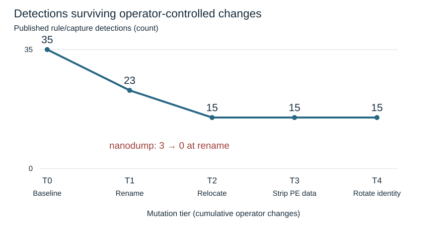

<div align="center">

# Detection Under Load

### How much Sigma detection coverage survives when an attacker renames or relocates the tool?

A reproducible benchmark of published Windows detections for **LSASS credential dumping (ATT&CK T1003.001)**.

[**Report**](https://yacndehfuli.github.io/detection-under-load/) ·
[**Method**](docs/method.md) ·
[**Reproduce**](docs/reference.md) ·
[**Authored Rules**](rules/) ·
[**Upstream Findings**](contrib/) ·
[**SigmaHQ PR #6311**](https://github.com/SigmaHQ/sigma/pull/6311)

[](https://github.com/YaCnDehfuli/detection-under-load/actions/workflows/ci.yml)
[](https://www.python.org/)
[](https://sigmahq.io/)
[](LICENSE)

</div>

---

## What this project does

Detection rules often depend on details an attacker can change without changing the underlying behavior: executable names, paths, output filenames, version metadata, or fingerprints.

**Detection Under Load measures that dependency.**

It runs published Sigma detections against **seven recorded implementations of LSASS credential dumping**, then progressively changes attacker-controlled artifacts while leaving operating-system behavior intact.

| Benchmark | Scale |
|---|---:|
| Published Sigma rules evaluated | **80** |
| LSASS-dumping implementations | **7** |
| Attack events | **354,229** |
| Rule × capture pairs | **581** |
| Eligible non-target events for the LSASS rule | **514,202** |
| Independent APT29 transfer events | **783,367** |

## Headline result

Published detection coverage drops sharply under simple operator changes:

| Experiment | Published rule/capture detections |
|---|---:|
| Recorded baseline | **35** |
| Rename attacker-controlled artifacts | **23** |
| Relocate them | **15** |
| Strip PE version metadata | **15** |
| Rotate recorded fingerprints | **15** |

**12 of 35 baseline detections disappear after renaming alone.**

`nanodump` falls from **3 published detections to 0** because all three depend on the literal string `dump`.

<p align="center">
  
</p>

The important distinction is *why* a rule misses. The benchmark separates:

- **Detected** — at least one event matched.
- **Logic miss** — required telemetry exists, but the rule does not match it.
- **Telemetry gap** — the recording does not contain the event or field the rule needs.
- **Out of scope** — the rule targets a different implementation.

That avoids treating missing telemetry as a failed detector.

## How the benchmark works

<p align="center">
  
</p>

At a high level:

1. Pin SigmaHQ and public security datasets to exact commits and archive hashes.
2. Compile and execute the selected Sigma detections against recorded Windows telemetry.
3. Replay each capture through cumulative operator-change tiers.
4. Classify misses and measure which detections survive each transformation.
5. Evaluate authored rules against non-target telemetry and an independent APT29 dataset.
6. Cross-check a subset against Zircolite.

The complete experimental design, inclusion rules, and limitations are in the **[methodology](docs/method.md)**.

## A concrete upstream finding

The benchmark exposed a semantic error in SigmaHQ's Dumpert detection.

The rule treated:

```text
09D278F9DE118EF09163C6140255C690
```

as an MD5, while both SigmaHQ's own repository and a recorded Dumpert execution identify it as the tool's **IMPHASH**.

The recorded process event contains:

```text
MD5=69C05093EB542E1C29A556A29E74E99A
IMPHASH=09D278F9DE118EF09163C6140255C690
```

The correction was approved by a SigmaHQ collaborator on 2026-09-21:

**[SigmaHQ/sigma#6311 — correct Dumpert process dumper hash type to IMPHASH](https://github.com/SigmaHQ/sigma/pull/6311)**

The full evidence and reproduction are in
[`contrib/dumpert-imphash-correction.md`](contrib/dumpert-imphash-correction.md).

## Authored detections

The repository also contains six Sigma rules written after examining the measured coverage gaps.

The broadest LSASS rule detects **7/7 attack captures** and produces **8 matches across 514,202 eligible non-target events**.

| Rule | ATT&CK | Captures detected | Non-target fires / 100k |
|---|---|---:|---:|
| LSASS Handle Request From Unexpected Process | T1003.001 | 7/7 | 1.56 |
| Process Started From A User Download Directory | T1204.002 | 7/7 | 0.99 |
| SeDebugPrivilege Enabled On A Token | T1134.001 | 4/7 | 1.48 |
| Remote Thread Started From Unbacked Memory | T1055.002 | 3/7 | 1.02 |
| LSASS Dump Via Comsvcs MiniDump Export | T1003.001 | 1/7 | 0.00 |
| PowerShell Script Block Calling MiniDumpWriteDump | T1003.001 | 1/7 | 0.00 |

These measurements are **evaluation results, not production false-positive rates**.

## Quick start

```bash
git clone https://github.com/YaCnDehfuli/detection-under-load.git
cd detection-under-load

python -m venv .venv
source .venv/bin/activate

python -m pip install -r requirements.txt pyyaml
scripts/ci-local.sh --fast
```

The full pipeline and individual commands are documented in
[`docs/reference.md`](docs/reference.md).

## Read the study

| Resource | Contents |
|---|---|
| **[Research report](https://yacndehfuli.github.io/detection-under-load/)** | Results, experiment design, findings, validation, and upstream impact |
| [Methodology](docs/method.md) | Experimental design, mutation model, and limitations |
| [Corpora](docs/corpora.md) | Datasets, provenance, and eligibility |
| [Selection](benchmark/selection.md) | Rule population and inclusion logic |
| [Design decisions](docs/decisions.md) | Important methodological choices |
| [Pipeline reference](docs/reference.md) | Commands, evaluator modules, and reproduction |
| [Upstream findings](contrib/) | Findings prepared or submitted to SigmaHQ |

## Scope

This study measures one sub-technique, seven implementations, and one primary lab corpus.

It does **not** claim that SigmaHQ generally lacks coverage, that every miss is a bad rule, or that the authored rules are production-ready. Rules that miss this corpus may provide useful coverage elsewhere, and telemetry absent from these captures may exist in production.

The benchmark therefore reports **logic misses, telemetry gaps, and out-of-scope rules separately** rather than collapsing them into one failure rate.

## License

[MIT](LICENSE). Third-party datasets and Sigma rules retain their original terms.
