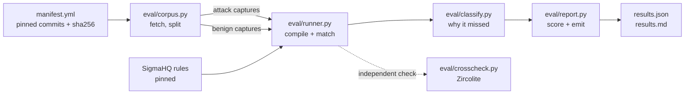

# chain-under-load

A measurement harness for detection rules, and what it found when pointed at
the published Sigma rules for LSASS credential dumping.

Result first, so the rest has context: 80 published rules select for
T1003.001. Run against seven real dumping tools in 354,229 events of recorded
Windows telemetry, each tool trips between 3 and 8 of them, median 5, and no
single rule detects more than 4 of the 7.

Rename the binary and the output file, changing nothing about how the tool
reads memory, and that falls to between 0 and 7. nanodump goes to zero.
procdump goes from 7 to 2. Move the renamed binary into `System32` and the
access-mask rules drop out too, not because they read a name but because they
exclude that directory themselves.

[Findings](findings.md) | [Method](docs/method.md) | [Results](benchmark/results.md) | [Decisions](docs/decisions.md)

## Why measure at all

Detection rules are written, tagged, reviewed and deployed largely on the
strength of their description. A rule says it detects credential dumping, it
carries `attack.t1003.001`, and it enters a pipeline. What almost never happens
is running it against the same technique carried out several different ways and
counting what comes out.

That gap is worth closing because the failure mode it hides is specific. A rule
can be correct, well written, and still keyed to something the operator chooses
freely, such as the name of a binary. Nothing in a static review catches that.
Only execution does.

So this repo asks one narrow question with a checkable answer: given one
technique performed seven ways, how many published rules fire on each?

## Why this technique and this corpus

T1003.001 gets the depth because of an accident of public data.
OTRF/Security-Datasets contains seven recordings of LSASS memory theft carried
out with seven different tools, in one lab, on one victim host, under one Sysmon
configuration. The tool is the only variable across them, which makes them
comparable in a way that assembled-from-elsewhere captures are not.

| capture | events | tool |
|---|---|---|
| campaign 01 | 53,698 | logonpasswords, mimikatz-style in-process read |
| campaign 02 | 42,482 | procdump, signed Sysinternals binary |
| campaign 03 | 41,954 | comsvcs, rundll32 calling the MiniDump export |
| campaign 04 | 40,568 | out-minidump, PowerShell reflective dump |
| campaign 05 | 59,707 | sharpdump, .NET port of out-minidump |
| campaign 06 | 58,096 | outflank-dumpert, direct syscalls |
| campaign 07 | 57,724 | nanodump, syscalls and a hand-rolled writer |

Every capture is a full recording window, so the events unrelated to the dump
are real background activity rather than a curated slice.

## The problem the architecture solves

Three things can make a rule fail to fire, and only one of them is the rule's
fault.

1. The capture never recorded the field the rule reads.
2. The rule targets a tool that was not run.
3. The rule had everything it needed and did not match.

A harness that cannot tell these apart produces a number that says more about
the Sysmon configuration than about the detection content. Every design call
below follows from needing to separate them, and from needing the separation to
be checkable by someone who does not trust me.

## Pipeline



### benchmark/manifest.yml

Pins every input. Source repositories by commit, and the seven campaign
archives by sha256 as well. A rerun on another machine reads the same bytes or
fails loudly.

### eval/corpus.py

Fetches the pinned sources with a blobless clone and a cone sparse-checkout,
then splits captures into attack and benign sets.

The contract that matters is benign eligibility, since it decides what counts
as a false positive. A capture is benign for technique T when its metadata
lists ATT&CK techniques, none of them is T, and none shares a parent technique
with T. The sibling test keeps a T1003.002 capture from being scored against a
T1003.001 rule.

Captures with no ATT&CK mapping are dropped rather than assumed clean. Thirteen
of the 122 Windows host captures are unlabelled and one of those is an LSASS
dump variant, which is the whole argument for the rule. For T1003.001 that
leaves 91 captures and 514,202 events.

### eval/runner.py

Parses rules with pySigma and compiles their condition trees into predicates,
then runs them against event dictionaries. Nothing is converted to a query
language.

That is the central design call. Routing every rule through a third-party
Sigma-to-SQL backend would fold that backend's coverage gaps into results
published under the rules' name. Owning the matching means owning the risk of
getting it wrong, which is why the semantics are pinned by tests and checked
against another engine.

Every rule runs through the `sysmon` and `windows-logsources` pipelines
chained, so a `process_access` rule gets its EventID 10 and a Security rule
gets its Channel. No rule is judged after being run through a pipeline it did
not ask for.

### eval/classify.py

Decides why a rule did not fire. Each rule and capture pair lands in one of
four states.

| class | meaning |
|---|---|
| `detected` | matched at least one event |
| `miss-telemetry` | the capture lacks the event type or a field the rule requires |
| `out-of-scope` | the rule is keyed to a named binary the capture never ran |
| `miss-logic` | everything the rule needs was present and it still did not match |

Only requirements on the AND spine of a condition count. A field appearing
solely inside a filter cannot explain a miss, because the filter simply does not
apply. Getting this wrong is not hypothetical: an earlier version counted
filter-only fields and put a rule in `miss-telemetry` over `Provider_Name`,
which that rule only used to exclude events.

For `out-of-scope`, a requirement counts as tool identity when every field in it
names a binary. Access masks and call traces are excluded on purpose, since
failing to match those is the detection logic falling short.

### eval/report.py

Selects rules for a technique, scores them, measures false positives against
the benign corpus and emits `results.json` plus a markdown table. Every number
in this README comes from that json. `--check` re-runs the benchmark and fails
when the committed results have drifted, which is what CI runs.

The headline is per tool rather than per rule. Scoring a rule needs a decision
about whether a procdump-specific rule ought to catch nanodump, and no
mechanical criterion settles that cleanly. Counting how many rules stand between
an operator and a given tool needs no such decision. Both numbers are in the
json; only the unarguable one leads.

Rules from this repo are counted separately from published ones, because they
were written after reading these results.

### eval/crosscheck.py

The cross-check against an engine I did not write. The same rules and captures
go through Zircolite, which converts Sigma to SQL and queries SQLite. Across
seven campaigns and 23 `process_access` rules the two agree on which rules fire
and on how many events each matches, with no disagreements.

That comparison is what lets the benchmark claim a miss belongs to the rule. It
covers the `process_access` rule set, not all 83 selected rules.

## What it found

80 published rules select for T1003.001, 79 by ATT&CK tag and 1 by logsource.

| tool | published rules firing | including this repo |
|---|---|---|
| out-minidump | 8 | 10 |
| procdump | 7 | 8 |
| comsvcs | 6 | 8 |
| outflank-dumpert | 5 | 6 |
| logonpasswords | 3 | 4 |
| sharpdump | 3 | 4 |
| nanodump | 3 | 4 |

Of 581 rule and capture pairs, 44 detected, 207 were logic misses, 273 out of
scope, and 57 were telemetry gaps.

The misses share three shapes.

**Detections keyed to strings the operator picks.** All three of nanodump's
detections matched on the literal `dump`: in the image name
(`nanodump.x64.exe`), in the output filename (`lsass_dump.dmp`), and in the
command line carrying that filename. Rename both and its published coverage goes
to zero. sharpdump is close behind, with two of three needing `dump` in the
image name.

**Access masks removed as too noisy.** nanodump opened LSASS with
`GrantedAccess` `0x1010`, and `0x1010`, `0x1400` and `0x1410` are all commented
out of the two main mask rules with the note "Too many false positives". That is
a trade the rule authors made knowingly. It costs nanodump and the in-process
mimikatz read, which are the tools using the removed masks.

**A directory filter the tools walk through.** `Potentially Suspicious
GrantedAccess Flags On LSASS` drops every source under `Program Files`,
`System32` and `SysWOW64`. In these captures procdump ran from
`C:\Program Files\procdump64.exe`, SharpDump from
`C:\Program Files\SharpDump.exe`, and nanodump from
`C:\Windows\System32\nanodump.x64.exe`.

## What survives a rename

The coverage above is measured against the names these operators happened to
pick, which makes it an upper bound. Published rules firing after each change:

| tool | baseline | renamed | relocated | rebuilt | control |
|---|---|---|---|---|---|
| out-minidump | 8 | 7 | 5 | 5 | 8 |
| procdump | 7 | 2 | 2 | 2 | 7 |
| comsvcs | 6 | 5 | 4 | 4 | 6 |
| outflank-dumpert | 5 | 3 | 1 | 1 | 5 |
| logonpasswords | 3 | 3 | 2 | 2 | 3 |
| sharpdump | 3 | 2 | 2 | 2 | 3 |
| nanodump | 3 | 0 | 0 | 0 | 3 |

Nothing behavioural is altered. The access mask, the call trace and the process
tree keep the values that were recorded, and only strings the operator chose
freely change. The control column mutates a field no selected rule reads and
comes back identical to the baseline on all seven, which is what makes the rest
of the table readable as fragility rather than as damage.

Relocation costs the access-mask rules, which read no filename at all. They are
lost to their own filter, the one excluding every source under `Program Files`
and `System32`.

The six rules in `rules/` are unchanged at every tier, though they were written
after reading these findings, so that is weaker evidence than it looks.
[findings.md](findings.md) has the per-rule losses and the reasoning, including
why the rebuild tier turned out flat.

This measures sensitivity to renaming and relocation on one corpus. An operator
who changes how the tool reads memory, rather than what it is called, is
outside what any of it shows.

## What I wrote in response

Six rules in `rules/`, each measured against the captures and against a benign
corpus scoped to its own technique.

| rule | technique | detects | fp/100k |
|---|---|---|---|
| Process Started From A User Download Directory | T1204.002 | 7/7 | 0.99 |
| LSASS Handle Request From Unexpected Process | T1003.001 | 7/7 | 1.56 |
| SeDebugPrivilege Enabled On A Token | T1134.001 | 4/7 | 1.48 |
| Remote Thread Started From Unbacked Memory | T1055.002 | 3/7 | 1.02 |
| LSASS Dump Via Comsvcs MiniDump Export | T1003.001 | 1/7 | 0.00 |
| PowerShell Script Block Calling MiniDumpWriteDump | T1003.001 | 1/7 | 0.00 |

The LSASS rule keys on the caller rather than on names the operator controls,
and its filters pin a binary to its expected directory instead of excluding
directories wholesale. It detects 7 of 7 with 8 false positives in 514,202
benign events, of which 6 are one Azure guest agent and 2 are PowerShell.
PowerShell is left unfiltered because Out-Minidump is PowerShell.

The low counts are the corpus rather than the rules. Only three of the seven
intrusions inject into another process, and only one uses comsvcs.

## Does any of it generalise

The whole set was pointed at the APT29 evaluation captures, 783,367 events
across two days and several hosts, which none of these rules was written for.
Three of the six fire on both days with no tuning. The three that stay quiet are
the narrow ones, none of which describes how that intrusion moved.

That is one more dataset, not a deployment.

## Where the rules run

Each rule is converted to Splunk SPL and to Kusto, the query language Sentinel
and Defender XDR use, and both are committed under
[`rules/converted/`](rules/converted) so the generated query is readable in a
diff rather than only inside a CI step. `scripts/convert_rules.py --check`
fails when they drift from a fresh conversion.

Conversion is not deployment. It says the detection logic expresses cleanly in
each query language, nothing about field availability, licensing or tuning in
any particular estate. The measurements in this repo were made by the harness
in `eval/`, not by either SIEM.

## Running it

```bash
pip install -r requirements.txt pyyaml
python -m eval.corpus --fetch     # about 1.5 GB, pinned by commit and sha256
python -m eval.report --run       # benchmark/results.json and results.md
python -m eval.chain --run        # benchmark/chain.json and chain.md
python -m eval.crosscheck         # agreement against Zircolite
python -m pytest tests -q         # 61 tests
```

## Limits

Seven tools is seven tools, and one lab is one lab. A field missing from a
capture is not proof it would be missing in production, which is why telemetry
gaps are separated from logic misses instead of counted against the rules. The
benign corpus is 91 atomic attack simulations, real host telemetry but a quiet
one: 514,202 events separates a rule that fires a handful of times from one that
fires constantly, and it does not support comparing 0.1 against 0.3 per 100k.

None of this is a verdict on SigmaHQ. Their rules cover far more ground than
these seven captures can show, and a rule that misses here may be carrying its
weight somewhere this corpus cannot see. Full limitations in
[docs/method.md](docs/method.md).
