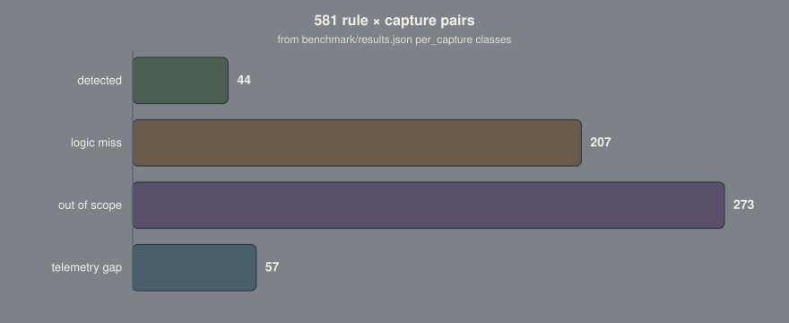

# Detection Under Load

Benchmarks published Sigma coverage for ATT&CK T1003.001 as an operator renames
or relocates the dumping tool.

[](LICENSE)
[](https://github.com/YaCnDehfuli/detection-under-load/actions/workflows/ci.yml)
[](https://www.python.org/)
[](https://sigmahq.io/)
[](https://github.com/YaCnDehfuli/detection-under-load/releases)

[Open the prepared results report](docs/index.html)

## Results

The benchmark evaluates 80 published Sigma rules against seven LSASS-dump
captures containing 354,229 events. Each tool triggers 3–8 published rules
(median 5); no published rule detects more than four of the seven captures.

Renaming removes 12 of 35 baseline detections; relocation removes eight more.
nanodump falls from three published detections to zero because all three require
the literal string `dump`.

The authored LSASS rule detects 7/7 captures with eight false positives across
91 benign captures and 514,202 events (1.56/100k). The repository contains six
authored rules; in a transfer test over 783,367 APT29 events, three fire on both
days. This is a transfer test, not a deployment.

<p align="center">
  
</p>
<sub>581 rule × capture pairs from <code>benchmark/results.json</code>: 44 detected, 207 logic misses, 273 out of scope, 57 telemetry gaps.</sub>

**Research artifact.** This repository is neither a SIEM nor a deployed
detection product.


## Quickstart

```bash
git clone https://github.com/YaCnDehfuli/detection-under-load.git
cd detection-under-load
python -m venv .venv
source .venv/bin/activate
python -m pip install -r requirements.txt pyyaml
scripts/ci-local.sh --fast
```

[Pipeline, evaluator modules and individual commands](docs/reference.md).

## Why measure at all

Detection rules are often written, tagged, reviewed, and deployed largely on
the strength of their descriptions. A rule claims to detect credential dumping,
carries `attack.t1003.001`, and enters a pipeline. Far less often is it executed
against several implementations of the same technique and measured directly.

That gap hides a specific failure mode: a well-formed rule can depend on an
artifact the operator controls, such as a binary name. Static review alone does
not reveal how much coverage that dependency costs; execution does.

The repository therefore asks one narrow, reproducible question: when one
technique is performed seven ways, how many published rules fire on each?

## What it found

The benchmark selects 80 published rules for T1003.001: 79 by ATT&CK tag and one
by log source.

| tool | published rules firing | including this repo |
|---|---|---|
| out-minidump | 8 | 10 |
| procdump | 7 | 8 |
| comsvcs | 6 | 8 |
| outflank-dumpert | 5 | 6 |
| logonpasswords | 3 | 4 |
| sharpdump | 3 | 4 |
| nanodump | 3 | 4 |

Across 581 rule-capture pairs, 44 were detected, 207 were logic misses, 273 were
out of scope, and 57 had telemetry gaps.

The misses fall into three patterns.

**Detections keyed to operator-controlled strings.** All three nanodump
detections match the literal `dump`: in the image name
(`nanodump.x64.exe`), in the output filename (`lsass_dump.dmp`), and in the
command line containing that filename. Renaming the executable and output file
reduces its published coverage to zero. sharpdump is close behind: two of its
three detections require `dump` in the image name.

**Access masks excluded as too noisy.** nanodump opened LSASS with
`GrantedAccess` `0x1010`, and `0x1010`, `0x1400` and `0x1410` are all commented
out of the two main process-access mask rules. That is a trade the rule authors
made knowingly. It costs coverage for nanodump and the in-process mimikatz read,
which use the removed masks. A Security-channel rule for the same sub-technique
still selects on `0x1010`, so the repository treats the same mask in two ways;
[contrib/lsass-access-mask-exclusions.md](contrib/lsass-access-mask-exclusions.md)
has the counts.

**Directory filters that exclude the tools.** `Potentially Suspicious
GrantedAccess Flags On LSASS` drops every source under `Program Files`,
`System32` and `SysWOW64`. In these captures procdump ran from
`C:\Program Files\procdump64.exe`, SharpDump from
`C:\Program Files\SharpDump.exe`, and nanodump from
`C:\Windows\System32\nanodump.x64.exe`.

## What survives a rename

The baseline coverage reflects the names used in these captures and is therefore
an upper bound. The benchmark replays every capture through five cumulative
tiers of adversary effort: rename operator-provided artifacts, relocate them to
a directory excluded by the access-mask rules, clear the PE version resource,
and rotate recorded fingerprints. No tier rewrites behavior reported by the
operating system.


<sub>Published rule/capture detections: T0 35, T1 23, T2–T4 15; nanodump 3 → 0 at T1. Generated from <code>benchmark/sensitivity.json</code>, <code>per_capture → tiers → published_firing</code>.</sub>

| tool | T0 | T1 rename | T2 relocate | T3 strip-pe | T4 new identity |
|---|---|---|---|---|---|
| out-minidump | 8 | 7 | 4 | 4 | 4 |
| procdump | 7 | 3 | 3 | 3 | 3 |
| comsvcs | 6 | 5 | 4 | 4 | 4 |
| outflank-dumpert | 5 | 3 | 1 | 1 | 1 |
| logonpasswords | 3 | 3 | 1 | 1 | 1 |
| sharpdump | 3 | 2 | 2 | 2 | 2 |
| nanodump | 3 | 0 | 0 | 0 | 0 |

Relocation defeats the access-mask rules even though they read no filename. Their
own filters exclude every source under `Program Files`, `System32`, and
`SysWOW64`. logonpasswords isolates this effect: it reads LSASS from an injected
thread, so renaming changes nothing while relocation removes two of its three
detections.

Clearing the version resource and rotating fingerprints do not change coverage
in this population. Rules that use those attributes to identify renamed tools
fall outside the measured set.

A separate control rewrites a field that no rule in the technique-scoped
selection reads. Coverage remains unchanged across all seven captures. In the
wider population, it changes one rule that does read the field, confirming that
the control is observable where expected.

This experiment measures sensitivity to renaming and relocation on one corpus
using a model of operator behavior. It does not cover changes to how a tool reads
memory.

## Authored rules

The six rules in `rules/` are each evaluated against the attack captures and a
benign corpus scoped to the rule's technique.

| rule | technique | detects | fp/100k |
|---|---|---|---|
| Process Started From A User Download Directory | T1204.002 | 7/7 | 0.99 |
| LSASS Handle Request From Unexpected Process | T1003.001 | 7/7 | 1.56 |
| SeDebugPrivilege Enabled On A Token | T1134.001 | 4/7 | 1.48 |
| Remote Thread Started From Unbacked Memory | T1055.002 | 3/7 | 1.02 |
| LSASS Dump Via Comsvcs MiniDump Export | T1003.001 | 1/7 | 0.00 |
| PowerShell Script Block Calling MiniDumpWriteDump | T1003.001 | 1/7 | 0.00 |

The LSASS rule keys on the caller rather than operator-controlled names. Its
filters bind a binary to its expected directory instead of excluding entire
directories. It detects 7/7 captures with eight false positives in 514,202
benign events: six from one Azure guest agent and two from PowerShell. PowerShell
remains unfiltered because Out-Minidump runs through PowerShell.

The lower detection counts reflect the corpus: only three of the seven
intrusions inject into another process, and only one uses comsvcs.

## Does any of it transfer

The transfer test runs all six rules against APT29 evaluation captures containing
783,367 events across two days and several hosts. None of the rules was written
for this dataset. Three fire on both days without tuning; the three narrower
rules remain quiet because their behaviors do not describe the intrusion.

This result covers one transfer dataset, not a deployment, and the evaluation
does not reconstruct the intrusion's steps. [docs/decisions.md](docs/decisions.md)
explains why the corresponding module is no longer called a chain.

## Limitations

Seven tools is seven tools, and one lab is one lab. The tiers are a model of an
operator rather than a recording of one, and everything the model refuses to
rewrite makes the measured loss smaller than it would otherwise look. A field missing from a
capture is not proof it would be missing in production, which is why telemetry
gaps are separated from logic misses instead of counted against the rules. The
benign corpus is 91 atomic attack simulations, real host telemetry but a quiet
one: 514,202 events separates a rule that fires a handful of times from one that
fires constantly, and it does not support comparing 0.1 against 0.3 per 100k.

None of this is a verdict on SigmaHQ. Their rules cover far more ground than
these seven captures can show, and a rule that misses here may be carrying its
weight somewhere this corpus cannot see. Full limitations in
[docs/method.md](docs/method.md).


## Related work in this portfolio

Memory forensics → detection engineering → evaluation of AI in security operations.

| Repository | What it establishes |
| --- | --- |
| [VolMemLyzer3](https://github.com/YaCnDehfuli/VolMemLyzer3-CLI_forensic_tool) | Volatility 3 orchestration and feature extraction; 2.4× parallel speedup on a pinned 10-plugin set |
| [VADViT](https://github.com/YaCnDehfuli/VADViT) | Published ViT classification of process memory — 99.2% binary accuracy, 92% macro-F1 |
| [MalGraph](https://github.com/YaCnDehfuli/MalGraph) | Why memory-time recovery matters: UPX packing leaves 5.4% of functions statically recoverable |
| [MemTriage](https://github.com/YaCnDehfuli/MemTriage) | The analyst workspace that consumes both |
| **detection-under-load** | Published Sigma coverage for T1003.001 collapses under operator-controlled renaming |
| [agent-under-load](https://github.com/YaCnDehfuli/agent-under-load) | Whether an LLM agent can triage those detections, measured against deterministic ground truth |

## License

[MIT](LICENSE). Third-party datasets and Sigma rules retain their original terms.
