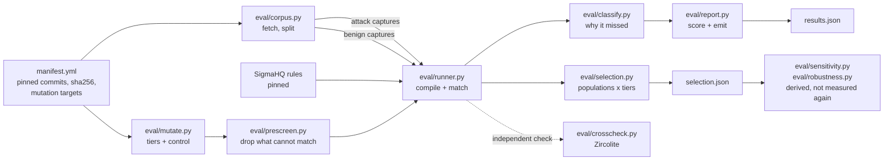

# Pipeline and command reference

Run commands from the repository root. [Results report](index.html) · [Repository README](../README.md).

## Why this technique and this corpus

T1003.001 gets the depth because of an accident of public data.
OTRF/Security-Datasets contains seven recordings of LSASS memory theft carried
out with seven different tools, in one lab, on one victim host, under one Sysmon
configuration. The tool is the only variable across them, which makes them
comparable in a way that assembled-from-elsewhere captures are not.

| capture | events | tool |
|---|---|---|
| campaign 01 | 53,698 | logonpasswords, mimikatz-style in-process read |
| campaign 02 | 42,482 | procdump, signed Sysinternals binary |
| campaign 03 | 41,954 | comsvcs, rundll32 calling the MiniDump export |
| campaign 04 | 40,568 | out-minidump, PowerShell reflective dump |
| campaign 05 | 59,707 | sharpdump, .NET port of out-minidump |
| campaign 06 | 58,096 | outflank-dumpert, direct syscalls |
| campaign 07 | 57,724 | nanodump, syscalls and a hand-rolled writer |

Every capture is a full recording window, so the events unrelated to the dump
are real background activity rather than a curated slice.

## The problem the architecture solves

Three things can make a rule fail to fire, and only one of them is the rule's
fault.

1. The capture never recorded the field the rule reads.
2. The rule targets a tool that was not run.
3. The rule had everything it needed and did not match.

A harness that cannot tell these apart produces a number that says more about
the Sysmon configuration than about the detection content. Every design call
below follows from needing to separate them, and from needing the separation to
be checkable by someone who does not trust me.

## Pipeline



### benchmark/manifest.yml

Pins every input. Source repositories by commit, and the seven campaign
archives by sha256 as well. A rerun on another machine reads the same bytes or
fails loudly.

### eval/corpus.py

Fetches the pinned sources with a blobless clone and a cone sparse-checkout,
then splits captures into attack and benign sets.

The contract that matters is benign eligibility, since it decides what counts
as a false positive. A capture is benign for technique T when its metadata
lists ATT&CK techniques, none of them is T, and none shares a parent technique
with T. The sibling test keeps a T1003.002 capture from being scored against a
T1003.001 rule.

Captures with no ATT&CK mapping are dropped rather than assumed clean. Thirteen
of the 122 Windows host captures are unlabelled and one of those is an LSASS
dump variant, which is the whole argument for the rule. For T1003.001 that
leaves 91 captures and 514,202 events.

### eval/runner.py

Parses rules with pySigma and compiles their condition trees into predicates,
then runs them against event dictionaries. Nothing is converted to a query
language.

That is the central design call. Routing every rule through a third-party
Sigma-to-SQL backend would fold that backend's coverage gaps into results
published under the rules' name. Owning the matching means owning the risk of
getting it wrong, which is why the semantics are pinned by tests and checked
against another engine.

Every rule runs through the `sysmon` and `windows-logsources` pipelines
chained, so a `process_access` rule gets its EventID 10 and a Security rule
gets its Channel. No rule is judged after being run through a pipeline it did
not ask for.

### eval/classify.py

Decides why a rule did not fire. Each rule and capture pair lands in one of
four states.

| class | meaning |
|---|---|
| `detected` | matched at least one event |
| `miss-telemetry` | the capture lacks the event type or a field the rule requires |
| `out-of-scope` | the rule is keyed to a named binary the capture never ran |
| `miss-logic` | everything the rule needs was present and it still did not match |

Only requirements on the AND spine of a condition count. A field appearing
solely inside a filter cannot explain a miss, because the filter simply does not
apply. Getting this wrong is not hypothetical: an earlier version counted
filter-only fields and put a rule in `miss-telemetry` over `Provider_Name`,
which that rule only used to exclude events.

For `out-of-scope`, a requirement counts as tool identity when every field in it
names a binary. Access masks and call traces are excluded on purpose, since
failing to match those is the detection logic falling short.

### eval/report.py

Selects rules for a technique, scores them, measures false positives against
the benign corpus and emits `results.json` plus a markdown table. Every number
in this README comes from that json. `--check` re-runs the benchmark and fails
when the committed results have drifted, which is what CI runs.

The headline is per tool rather than per rule. Scoring a rule needs a decision
about whether a procdump-specific rule ought to catch nanodump, and no
mechanical criterion settles that cleanly. Counting how many rules stand between
an operator and a given tool needs no such decision. Both numbers are in the
json; only the unarguable one leads.

Rules from this repo are counted separately from published ones, because they
were written after reading these results.

### eval/mutate.py

Replays a capture as the same intrusion carried out with more care: the
artifacts the operator brought get names the operator chose, then move, then lose
their version resource, then lose their recorded fingerprints. Which fields a
tier may rewrite follows from where their values come from rather than from a
list, and nothing the operating system reported about behaviour is ever
rewritten.

Beside the ladder, and not a rung of it, sits the control. It rewrites one field
no selected rule reads, and coverage after it has to be identical to the
baseline. If it is not, this harness is damaging events rather than the rules
being fragile, and the run refuses to write its output.

### eval/prescreen.py

Drops rules that cannot match a capture, so the wide population is tractable in
pure python. Three-valued and sound in one direction only: a rule is excluded on
proven impossibility and everything else is admitted, including every construct
the module will not reason about. The cheap half of the soundness argument runs
on every commit, the exhaustive half at release.

### eval/selection.py

The one expensive pass. Three published rule populations, plus this repository's
own, over the same seven captures, the same tiers and the same control. Coverage
is credited only on events naming an artifact the operator brought or wrote,
because a capture is a full recording window and most of it is background.
`benchmark/sensitivity.json` and `benchmark/robustness.json` are derived from
what it wrote rather than measured again, which is what stops two published
tables from disagreeing about what coverage means.

### eval/crosscheck.py

The cross-check against an engine I did not write. The same rules and captures
go through Zircolite, which converts Sigma to SQL and queries SQLite. Across
seven campaigns and 23 `process_access` rules the two agree on which rules fire
and on how many events each matches, with no disagreements.

That comparison is what lets the benchmark claim a miss belongs to the rule. It
covers the `process_access` rule set, not all 83 selected rules.

## Coverage depends on which rules you selected

Everything above is scoped to the rules carrying `attack.t1003.001`. That scoping
is not neutral. Three populations run over the same captures and tiers: the
tag-only set, the augmented set the benchmark scores, and every SigmaHQ rule that
compiles, is `product: windows` or product-agnostic, and reads an event type the
corpus contains. Coverage is credited only on events naming an artifact the
operator brought or wrote, because a capture is a full recording window and 98%
of it is background.

| tool | `S-tag` T0 | `S-tag` T1 | `W` T0 | `W` T1 | what `W` adds at T1 |
|---|---|---|---|---|---|
| procdump | 7 | 3 | 14 | 13 | Renamed ProcDump Execution, and two rules reading the Sysinternals registry key |
| outflank-dumpert | 5 | 3 | 14 | 12 | a rule keyed on the tool's import hash, lost only at T4 |
| nanodump | 3 | 0 | 12 | 9 | nothing about credential access |

The full table, and every rule in the compensating layer by name, is in
[benchmark/selection.md](../benchmark/selection.md). The rules in `rules/` are a
fourth population, reported apart from all three, because they were written after
reading the results above.

## What was offered upstream

Three drafts in [`contrib/`](../contrib), in ascending order of how arguable they
are, none of them sent anywhere. One encoding defect: `HackTool - Dumpert Process
Dumper Execution` reads an import hash as an MD5 and therefore cannot fire on the
tool it is named after, which is measured before and after the one-line
correction. One tuning tradeoff: the access-mask exclusions are a documented
choice, and the measurement offered is about one mask that three rules in the
same repository already treat two different ways. One proposal: the rule that
catches a renamed ProcDump is correctly tagged for masquerading, and the problem
is that nothing connects it to the credential-dumping rules it complements.

## Where the rules run

Each rule is converted to Splunk SPL and to Kusto, the query language Sentinel
and Defender XDR use, and both are committed under
[`rules/converted/`](../rules/converted) so the generated query is readable in a
diff rather than only inside a CI step. `scripts/convert_rules.py --check`
fails when they drift from a fresh conversion.

Conversion is not deployment. It says the detection logic expresses cleanly in
each query language, nothing about field availability, licensing or tuning in
any particular estate. The measurements in this repo were made by the harness
in `eval/`, not by either SIEM.

## Individual commands

The Quickstart above is the shortest reviewer path. The harness writes a durable
progress record instead of relying on an animated terminal spinner, so the same
signal remains readable in a terminal, redirected log, or CI transcript. Every
stage shows its position, exact command, live stdout/stderr, pass/fail state,
and elapsed time. Long or quiet stages also emit a `LIVE` heartbeat every 15
seconds:

```text
[----------------------------]   0% | READY | pipeline initialized
[----------------------------]   0% | RUN   | 1/4 job tests (no corpus, as CI sees it)
[#######---------------------]  25% | PASS  | job tests (no corpus, as CI sees it)
[##############--------------]  50% | PASS  | job rules: seed taxonomy cache
[##############--------------]  50% | LIVE  | 3/4 job rules: sigma check (15s elapsed)
[#####################-------]  75% | PASS  | job rules: sigma check
[############################] 100% | PASS  | pipeline complete
  summary: 4 passed, 0 failed
```

Use `--fast` for the first proof of life. The default mode adds the pinned
roughly 1.5 GB corpus and benchmark drift checks; `--release` also runs the
wide population and exhaustive prescreen checks.

```bash
python -m eval.corpus --fetch          # about 1.5 GB, pinned by commit and sha256
python -m eval.report --run            # benchmark/results.json and results.md
python -m eval.transfer --run          # benchmark/chain.json and chain.md
python -m eval.crosscheck              # agreement against Zircolite
python -m pytest tests -q              # unit tests, no corpus needed

# the one expensive pass, and the two records derived from it
python -m eval.report --run-selection    # benchmark/selection.json and .md
python -m eval.report --run-sensitivity  # benchmark/sensitivity.json and .md
python -m eval.report --run-robustness   # benchmark/robustness.json and .md

scripts/ci-local.sh --fast             # what a push runs, minus the corpus
scripts/ci-local.sh                    # add the corpus and drift checks
scripts/ci-local.sh --release          # add the wide run and exhaustive prescreen
```
